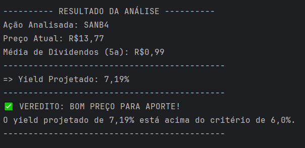

# **Analisador de Ações**

## **1. Visão Geral** 📈
O Analisador de Ações é uma aplicação desenvolvida para ajudar investidores a tomar decisões informadas. A sua principal funcionalidade é calcular o **Preço Teto** de uma ação, baseado no método de Décio Barsi, que utiliza a média de dividendos dos últimos cinco anos para projetar um *yield* desejado e, assim, indicar se a ação representa uma boa oportunidade de compra.

O projeto iniciou-se como uma aplicação de consola em Java e está a evoluir para uma solução full-stack robusta.

---

## **2. Arquitetura do Projeto** 🏗️
O projeto segue uma arquitetura que separa as responsabilidades, facilitando futuras expansões.

> **Lógica Central:** O coração do sistema reside na classe `Acao.java`, que contém os seus atributos, e no `AcaoMenu.java`, que orquestra a interação com o utilizador e aplica as regras de negócio, como o cálculo do Preço Teto baseado no método Barsi.

* **`AcaoMenu.java`**: Ponto de entrada e controlo da aplicação de consola. Contém o menu principal e a lógica para interagir com o utilizador.
* **`config`**: Responsável pela configuração da ligação com o banco de dados.
    * `ConnectionSQL.java`: Fornece um método para obter uma ligação ativa com o banco de dados MySQL.
* **`model`**: Contém a classe de entidade.
    * `Acao.java`: Representa uma ação, contendo os seus atributos (ticker, preço, etc.).
* **`dao` (Data Access Object)**: Camada de acesso aos dados.
    * `AcaoDAO.java`: Implementa todas as operações de CRUD (Create, Read, Update, Delete) com o banco de dados.

```
/
|-- database/
|   `-- database.sql
|
|-- src/
|   |-- AcaoMenu.java (Ponto de entrada)
|   |
|   |-- config/
|   |   `-- ConnectionSQL.java
|   |
|   |-- dao/
|   |   `-- AcaoDAO.java
|   |
|   `-- model/
|       `-- Acao.java
|
|-- .gitignore
|-- LICENSE
`-- README.md
```

---

## **3. Demonstração (Versão Consola)** 🖥️
A imagem abaixo ilustra a saída da análise de uma ação, executada diretamente no terminal.

<p align="center">
  
</p>

---

## **4. Banco de Dados** 🗄️
Para suportar o armazenamento das ações analisadas, o sistema utilizará um banco de dados MySQL chamado `stock`. O script para criação da estrutura encontra-se no ficheiro `database/database.sql` dentro do repositório.

### **Script SQL (DDL)**
```sql
CREATE DATABASE IF NOT EXISTS stock;
USE stock;

-- Tabela para armazenar as ações analisadas
CREATE TABLE todasAcoes (
    id_acao INT PRIMARY KEY AUTO_INCREMENT,
    ticker VARCHAR(10) NOT NULL UNIQUE,
    setor VARCHAR(50),
    precoAtual DECIMAL(10, 2),
    mediaDivCincoAnos DECIMAL(10, 2)
);

-- Exemplo de inserção
INSERT INTO todasAcoes (ticker, setor, precoAtual, mediaDivCincoAnos) 
VALUES ('TAEE11', 'ENERGIA ELÉTRICA', 35.80, 3.50);
```

---

## **5. Como Configurar e Executar (Versão Consola)** 🚀

### **5.1. Pré-requisitos**
* **JDK 8 ou superior:** Essencial para compilar e executar o código.
* **Servidor MySQL:** Um banco de dados ativo para a persistência dos dados.
* **IDE Java:** Recomenda-se o uso de Eclipse, IntelliJ IDEA ou VS Code.
* **Driver JDBC para MySQL:** O conector (`.jar`) deve ser adicionado ao *classpath* do projeto.

### **5.2. Passos para Execução**
1.  **Clone o Repositório**
    Abra um terminal e clone o projeto para a sua máquina local.
    ```bash
    git clone [https://github.com/MassolaGabriel/stock_value_analyzer.git](https://github.com/MassolaGabriel/stock_value_analyzer.git)
    cd stock_value_analyzer
    ```

2.  **Configure o Banco de Dados**
    O script para criação do banco de dados (`database.sql`) está localizado na pasta `database`. Execute este ficheiro no seu cliente MySQL para criar o banco `stock` e a tabela `todasAcoes`.

3.  **Ajuste a Ligação**
    Navegue até ao ficheiro `src/config/ConnectionSQL.java` e verifique se as constantes `HOST`, `USER` e `PASSWORD` correspondem às credenciais do seu banco de dados.
    ```java
    private static final String HOST = "jdbc:mysql://localhost:3306/stock"; // Verifique a porta
    private static final String USER = "root";
    private static final String PASSWORD = "sua_senha_aqui";
    ```

4.  **Compile e Execute**
    Importe o projeto na sua IDE, adicione o Driver JDBC e execute o método `main` da classe `AcaoMenu.java`.

---

## **6. Funcionalidades e Próximos Passos** ✨

### **Backend (Consola) - Implementado**
* **Análise de Preço Teto (Método Barsi):** ✅ Calcula o preço máximo a ser pago por uma ação para obter um *yield* mínimo de 6%, ajudando o investidor a identificar pontos de entrada seguros.
* **CRUD Completo de Ações:** ✅
    * **Cadastrar:** Salva novas ações e os seus dados financeiros no banco de dados.
    * **Listar:** Exibe todas as ações salvas no portfólio.
    * **Buscar por Ticker:** Localiza rapidamente uma ação específica.
    * **Atualizar:** Permite a modificação dos dados de uma ação existente.
    * **Remover:** Apaga uma ação do portfólio.
* **Menu Interativo via Consola:** ✅ Todas as funcionalidades são acessíveis através de um menu de fácil utilização no terminal, com tratamento de erros de entrada.

### **Evolução para Full-Stack (Em Desenvolvimento)**
* **API REST com Spring Boot:** ⚙️ A lógica de negócio está a ser migrada para uma API robusta e escalável utilizando o ecossistema Spring Boot, expondo endpoints para todas as operações de CRUD e análises.
* **Frontend com Angular:** 👨‍💻 Está a ser desenvolvida uma interface web moderna e reativa com Angular para consumir a API, proporcionando uma experiência de utilizador rica e interativa.
* **Implantação na Nuvem com AWS:** ☁️ O objetivo final é implantar a solução completa (Frontend, API Spring Boot e Banco de Dados) na Amazon Web Services, garantindo alta disponibilidade, segurança e acesso global.
